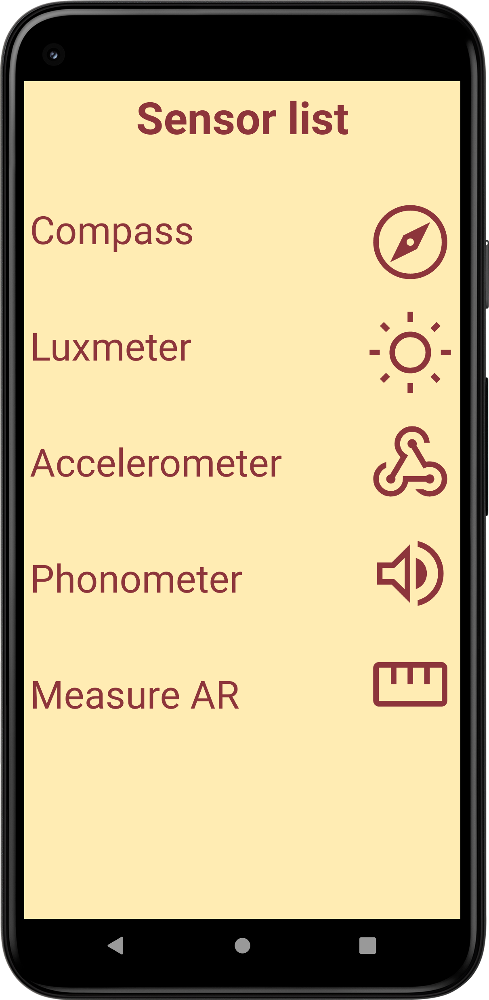

# AndroidSensors
> <b>Author: Nicola De Nicolais</b>

## Screen preview

## Description
This app provides an easy way to access sensors in Android phones. The outputs of measure realized by the sensors of the app are . txt files that are saved inside the folder created at first opening of app.

## Features

Compass

Luxmeter

Accelerometer

Phonometer

AR Measurements
